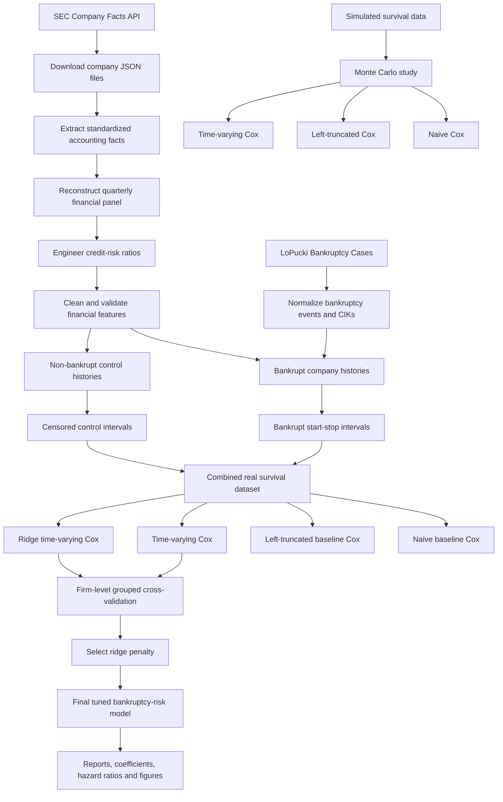
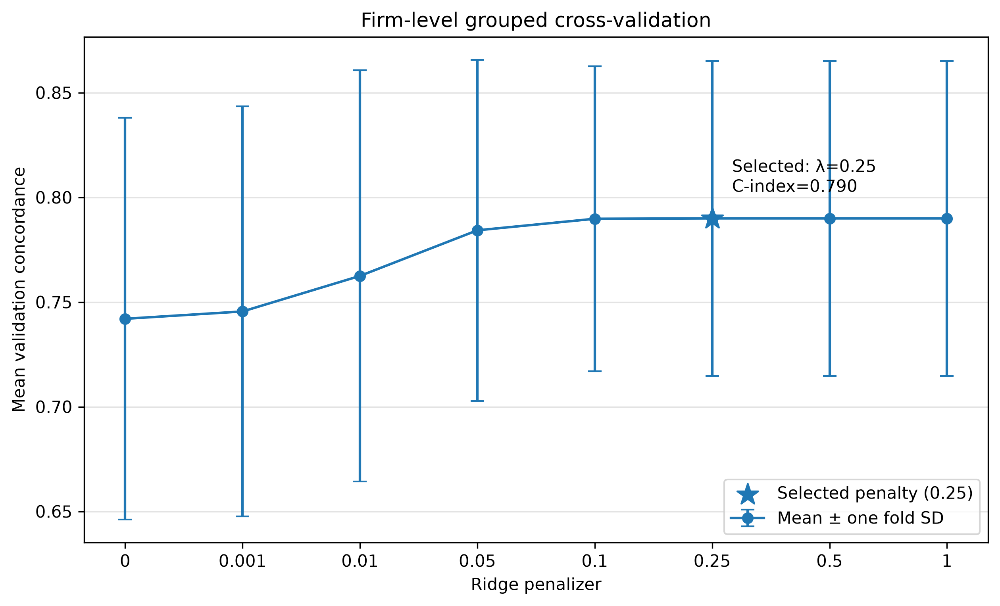
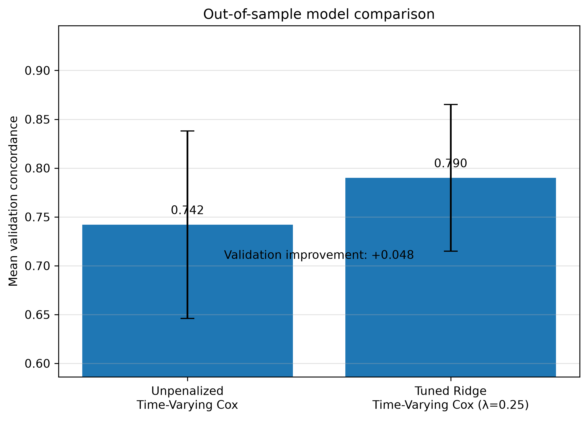
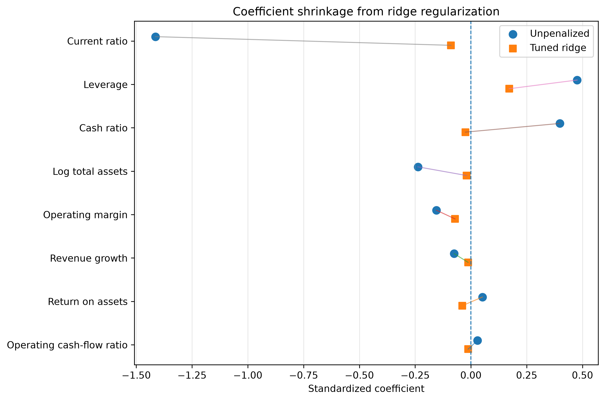
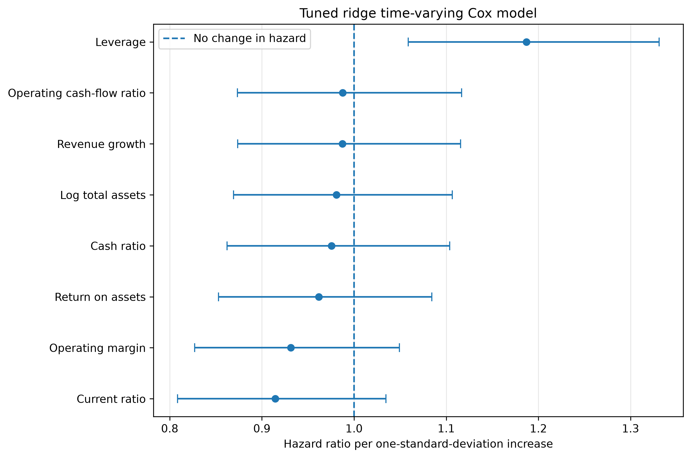

# Corporate Credit Risk Survival Analysis

[](https://www.python.org/)
[](#testing)
[](#project-status)
[](#license)

An end-to-end corporate bankruptcy risk research pipeline combining:

- SEC Company Facts financial statements
- LoPucki bankruptcy filing events
- quarterly financial-ratio engineering
- start–stop survival datasets
- Monte Carlo estimator validation
- classical Cox models
- time-varying Cox models
- ridge regularization
- firm-level grouped cross-validation

The project treats bankruptcy as a **time-to-event problem** rather than a static binary classification problem. Each company contributes a sequence of quarterly financial observations, allowing its estimated bankruptcy hazard to change as its financial condition evolves.

---

## Key Results

The final empirical dataset contains:

| Metric | Value |
|---|---:|
| Companies | 88 |
| Bankrupt companies | 40 |
| Control companies | 48 |
| Start–stop intervals | 905 |
| Bankruptcy events | 40 |
| Model predictors | 8 |
| Cross-validation folds | 5 |

The tuned ridge time-varying Cox model improved out-of-sample discrimination:

| Model | Mean validation concordance | Fold SD |
|---|---:|---:|
| Unpenalized time-varying Cox | 0.742 | 0.096 |
| Tuned ridge time-varying Cox | **0.790** | 0.075 |

The ridge penalty was selected through firm-level grouped cross-validation:

**Selected ridge penalty:** `λ = 0.25`

All quarterly observations belonging to a company remain in the same fold, preventing firm-level leakage.

### Main findings

- **Leverage** had a consistently positive relationship with bankruptcy hazard.
- **Current ratio** had a consistently negative relationship with bankruptcy hazard.
- Ridge regularization substantially reduced coefficient magnitude and instability.
- The tuned ridge model improved mean validation concordance by approximately **0.048**.
- The time-varying model used changing quarterly financial information that baseline models discard.

---

## Project Pipeline



---

## Why Survival Analysis?

Corporate bankruptcy is fundamentally a **time-to-event** problem rather than a binary classification problem. Instead of predicting only whether a company will fail, survival analysis estimates **how bankruptcy risk changes over time** as a firm's financial condition evolves.

A conventional classifier asks:

> **Will this company fail?**

A survival model asks:

> **How does a company's bankruptcy risk evolve over time, and when is failure most likely to occur?**

Compared with traditional classification methods, survival analysis naturally accommodates:

- **right-censored companies** that do not go bankrupt during the observation period,
- **unequal follow-up durations** across firms,
- **time-varying quarterly financial ratios**,
- **delayed observation and varying entry times**,
- **company-specific risk histories**, and
- **interpretable hazard ratios** for financial predictors.

This project uses a **time-varying Cox proportional hazards model**, allowing each firm's bankruptcy risk to change as new quarterly financial information becomes available.

The model estimates the hazard function

```text
h(t) = h₀(t) × exp(β₁x₁(t) + β₂x₂(t) + ··· + βₚxₚ(t))
```

where:

- **h₀(t)** is the baseline hazard,
- **β** represents the estimated effect of each financial predictor, and
- **x(t)** denotes quarterly financial variables that are updated over time.

Consequently, a company's estimated bankruptcy risk is allowed to evolve each quarter rather than remaining fixed throughout the observation period. This makes the model substantially more realistic for corporate credit-risk analysis than approaches that rely on a single financial snapshot.

## Ridge Regularization

Financial ratios often contain overlapping information. For example:

- **Current ratio** and **cash ratio** both capture short-term liquidity.
- **Return on assets** and **operating margin** both measure profitability.
- **Leverage** and **debt growth** both reflect debt burden.

Such correlations can produce unstable coefficient estimates and reduce out-of-sample predictive performance, particularly when the number of bankruptcy events is modest.

To improve model stability, the project fits a **ridge-regularized time-varying Cox model**, which maximizes the penalized partial log-likelihood:

```text
ℓ(β) − λ Σ β²
```

where:

- **ℓ(β)** is the Cox partial log-likelihood,
- **β** is the vector of regression coefficients,
- **λ** controls the amount of L2 (ridge) regularization.

As **λ** increases, coefficient estimates are shrunk toward zero, reducing variance caused by multicollinearity while retaining the relative importance of the strongest predictors. This generally improves the model's ability to generalize to previously unseen companies.

The ridge penalty was selected using **grouped five-fold cross-validation**, ensuring that all quarterly observations from the same company remained within a single validation fold to prevent information leakage.

**Selected ridge penalty:** `λ = 0.25`

Candidate penalties evaluated:

```text
0.000, 0.001, 0.010, 0.050, 0.100, 0.250, 0.500, 1.000
```

The selected model achieved the highest mean validation concordance while using the **smallest penalty among statistically equivalent top-performing candidates**, providing a balance between predictive performance and coefficient stability.

## Empirical Figures

### Firm-level grouped cross-validation



The validation score increased as regularization was introduced and plateaued near the selected penalty.

### Out-of-sample model comparison



The tuned ridge model improved mean validation concordance from approximately **0.742** to **0.790**.

### Coefficient shrinkage



Ridge regularization moved unstable coefficient estimates toward zero while retaining the strongest directional signals.

### Tuned ridge hazard ratios



Hazard ratios are reported per one-standard-deviation increase in each predictor because features are standardized before fitting.

---

## Simulation Study

The project includes a separate Monte Carlo study to evaluate model behavior when the true coefficients are known.

Three estimators were compared:

1. Naive baseline Cox
2. Left-truncated baseline Cox
3. Time-varying Cox

The simulation study evaluates:

- coefficient bias
- absolute bias
- empirical standard deviation
- mean estimated standard error
- root mean squared error
- confidence-interval coverage

### Model-level simulation results

| Model | Mean absolute bias | Mean RMSE | Mean coverage |
|---|---:|---:|---:|
| Baseline-at-entry Cox | 0.2920 | 0.3047 | 0.2170 |
| Left-truncated baseline Cox | 0.2939 | 0.3066 | 0.2180 |
| Time-varying Cox | **0.0632** | **0.1157** | **0.8080** |

The simulation study provides methodological motivation for using changing quarterly financial covariates in the empirical analysis.

---

## Data Sources

### SEC Company Facts

Financial-statement observations are downloaded from the SEC Company Facts API.

Standardized accounting concepts include:

- cash and cash equivalents
- current assets
- current liabilities
- total assets
- total liabilities
- short-term debt
- long-term debt
- total debt
- stockholders’ equity
- revenue
- operating income
- net income
- operating cash flow
- interest expense
- depreciation and amortization

Raw downloaded data is not committed to the repository.

### LoPucki Bankruptcy Research Database

Bankruptcy events are derived from the LoPucki Bankruptcy Research Database cases table.

The processed event table includes:

- company CIK
- filing date
- bankruptcy chapter
- company name
- disposition
- industry information
- pre-bankruptcy assets
- pre-bankruptcy liabilities
- pre-bankruptcy sales

The source spreadsheet must be supplied locally because redistribution may be subject to the data provider’s terms.

---

## Financial Features

The final empirical model uses eight centralized predictors defined in:

```text
src/features/constants.py
```

| Feature | Interpretation |
|---|---|
| `leverage` | Debt relative to assets |
| `current_ratio` | Current assets relative to current liabilities |
| `cash_ratio` | Cash relative to current liabilities |
| `return_on_assets` | Net income relative to total assets |
| `revenue_growth` | Quarter-to-quarter revenue growth |
| `operating_cash_flow_ratio` | Operating cash flow relative to liabilities |
| `log_total_assets` | Logarithmic firm-size measure |
| `operating_margin` | Operating income relative to revenue |

Additional engineered features are available for diagnostics and future model extensions:

- debt growth
- EBITDA margin
- interest coverage
- low-interest-coverage indicator

---

## Models

### Simulation models

- Naive Cox
- Left-truncated Cox
- Time-varying Cox

### Real-data models

- Naive baseline Cox
- Calendar-time left-truncated baseline Cox
- Unpenalized time-varying Cox
- Ridge time-varying Cox

The baseline models retain only the first financial observation for each firm. The time-varying models use the complete quarterly history.

The empirical left-truncated model is a calendar-time benchmark. It is not identical to the delayed-entry mechanism used in the simulation study because the true beginning of each company’s risk history is not observed.

---

## Repository Structure

```text
corporate-credit-risk-survival-analysis/
│
├── configs/
│   ├── bankruptcy_companies.json
│   ├── companies.json
│   └── control_candidates.json
│
├── data/
│   ├── raw/
│   ├── processed/
│   └── simulated/
│
├── docs/
├── notebooks/
│
├── reports/
│   ├── figures/
│   ├── real_models/
│   │   ├── figures/
│   │   └── model_selection/
│   └── simulation_study/
│
├── scripts/
│   ├── download_companyfacts.py
│   ├── parse_lopucki_cases.py
│   ├── run_sec_pipeline.py
│   ├── build_survival_dataset.py
│   ├── build_control_survival_dataset.py
│   ├── build_real_survival_dataset.py
│   ├── run_time_varying_monte_carlo.py
│   ├── generate_simulation_report.py
│   ├── run_real_model_selection.py
│   ├── run_real_model_comparison.py
│   └── create_real_model_figures.py
│
├── src/
│   ├── data/
│   ├── evaluation/
│   ├── features/
│   ├── models/
│   ├── pipelines/
│   ├── simulation/
│   └── survival/
│
├── tests/
├── Makefile
├── requirements.txt
└── README.md
```

---

## Installation

### 1. Clone the repository

```bash
git clone https://github.com/jiyabajaj19/corporate-credit-risk-survival-analysis.git
cd corporate-credit-risk-survival-analysis
```

### 2. Create a virtual environment

Windows PowerShell:

```powershell
python -m venv .venv
.venv\Scripts\Activate.ps1
```

macOS or Linux:

```bash
python -m venv .venv
source .venv/bin/activate
```

### 3. Install dependencies

```bash
python -m pip install --upgrade pip
python -m pip install -r requirements.txt
```

---

## Running the Project

### Run the tests

```bash
python -m pytest -v
```

### Run the simulation study

```bash
python -m scripts.run_time_varying_monte_carlo
python -m scripts.generate_simulation_report
```

### Parse bankruptcy events

Place the LoPucki spreadsheet at:

```text
data/raw/lopucki/Cases.xlsx
```

Then run:

```bash
python -m scripts.parse_lopucki_cases
```

### Download SEC Company Facts

```bash
python -m scripts.download_companyfacts \
  --email "your-email@example.com" \
  --config configs/companies.json
```

Use a real email address in the SEC `User-Agent` as required by SEC access guidance.

### Run the SEC feature pipeline

```bash
python -m scripts.run_sec_pipeline \
  --input-directory data/raw/sec_companyfacts \
  --output-prefix sec
```

### Build the survival datasets

```bash
python -m scripts.build_survival_dataset
python -m scripts.build_control_survival_dataset
python -m scripts.build_real_survival_dataset
```

### Tune the ridge model

```bash
python -m scripts.run_real_model_selection
```

### Compare all real-data models

```bash
python -m scripts.run_real_model_comparison
```

### Generate empirical figures

```bash
python -m scripts.create_real_model_figures
```

---

## Makefile Commands

| Command | Description |
|---|---|
| `make test` | Run the complete test suite |
| `make simulation` | Run the time-varying Monte Carlo study |
| `make simulation-report` | Generate simulation tables and figures |
| `make bankrupt-survival` | Build bankrupt-firm intervals |
| `make control-survival` | Build censored control intervals |
| `make real-survival` | Build the combined empirical dataset |
| `make model-selection` | Tune the ridge penalty |
| `make model-comparison` | Fit and compare all empirical models |
| `make figures` | Generate real-model figures |
| `make final-analysis` | Run selection, comparison and figures |
| `make clean` | Remove generated outputs |

Windows users may run the equivalent Python commands directly if GNU Make is not installed.

---

## Testing

The repository includes tests for:

- SEC JSON parsing
- accounting concept standardization
- quarterly duration reconstruction
- financial-ratio construction
- LoPucki event parsing
- survival interval invariants
- control-company censoring
- baseline Cox models
- time-varying Cox models
- ridge regularization
- grouped firm-level folds
- penalty-grid evaluation
- report generation

Run:

```bash
python -m pytest -v
```

---

## Reproducibility

Generated data and reports are excluded from version control where appropriate.

To reproduce the final empirical results:

```bash
python -m scripts.build_survival_dataset
python -m scripts.build_control_survival_dataset
python -m scripts.build_real_survival_dataset
python -m scripts.run_real_model_selection
python -m scripts.run_real_model_comparison
python -m scripts.create_real_model_figures
```

The model-selection seed is fixed by default, so grouped folds are reproducible.

---

## Limitations

- The empirical sample is modest, with 40 observed bankruptcy events.
- Controls are public SEC filers and are not currently matched exactly by industry and calendar time.
- LoPucki primarily contains large public-company bankruptcies, limiting generalizability to smaller firms.
- Company Facts tags vary across issuers and reporting periods.
- The real-data left-truncation benchmark uses calendar entry time rather than the true beginning of financial distress.
- Validation concordance is based on each firm’s final observed interval and is not a complete time-dependent concordance estimator.
- Confidence intervals from the penalized model should be interpreted cautiously.
- Macroeconomic and market-price covariates are not yet included.

---

## Future Work

Potential extensions include:

- industry- and calendar-time-matched controls
- macroeconomic covariates
- market-price and volatility features
- rolling prediction horizons
- time-dependent AUC and Brier scores
- bootstrap performance intervals
- elastic-net Cox models
- random survival forests
- gradient-boosted survival models
- external validation on a separate bankruptcy dataset

---

## Project Status

The core research and modeling workflow is complete:

- [x] SEC ingestion
- [x] quarterly statement reconstruction
- [x] feature engineering
- [x] LoPucki bankruptcy events
- [x] bankrupt survival intervals
- [x] censored control intervals
- [x] simulation study
- [x] classical Cox models
- [x] time-varying Cox model
- [x] ridge regularization
- [x] grouped cross-validation
- [x] empirical model comparison
- [x] publication-quality figures
- [x] automated tests

---

## Author

**Jiya Bajaj**

University of Toronto  
Computer Science, Statistics and Quantitative Finance interests

---

## License

This project is available under the MIT License.

The SEC and LoPucki data sources remain subject to their respective terms of use and redistribution policies.